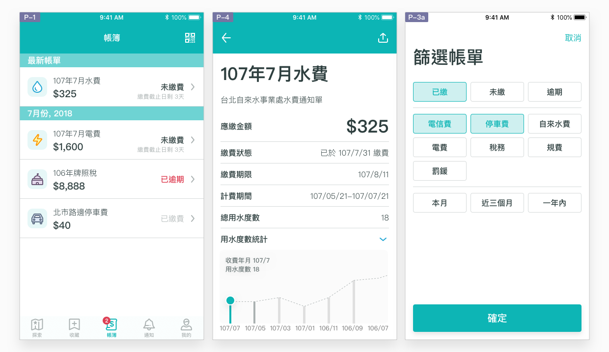
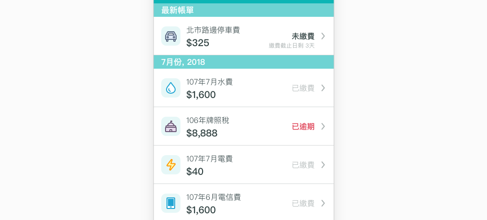
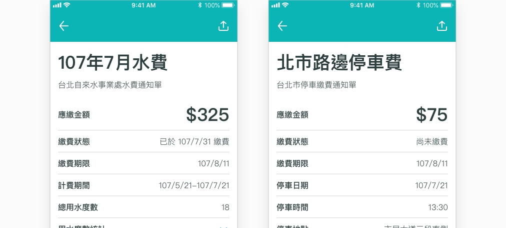

# 帳簿

## 利用帳簿頁，輕鬆避免逾繳或漏繳

與公部門有關的費用帳單，一直是使用者避不掉的開支。藉由帳簿設定，自動蒐集、推送十數種的帳單類別，可以幫助使用者減輕查帳的負擔，讓使用者不必再主動上網查詢帳單狀態。本 App 服務中，帳簿提供的是**連結帳單內容的官方收費記錄**，「繳費狀態」相對其他帳單資訊更為重要。於現行繳費管道多元的情況下，一筆帳單可能以家戶為單位，不只一人可以繳費，利用 App 繳費、設定銀行自動扣款、超商、臨櫃繳款等，提供具有公信力的工具，讓使用者更有系統地確認繳費完成。

## 如何達成良好的查帳體驗？

### 突顯需注意的帳單狀態

已繳費的帳單不需佔用使用者太多的注意力，而是「即將到期」及「已逾期」的帳單，才需使用者留意並有所行動。帳單狀態共分以下三種：

* **已逾期：**緊迫性最高，應盡快繳費以免受罰
* **未繳費：**顯示距離期限所剩天數，提醒使用者即時處理
* **已繳費：**供查詢即可

### 設法控制類別數量

本 App 服務利用類別圖示，設法幫助使用者於列表中識別內容，快速找到目標項目。圖像較文字能更容易識別，並以簡潔的線條繪製，具象徵及舉例的意涵，在大屏幕或小螢幕上都能清楚辨識。不過，**圖示難以表達較複雜的概念**，其所象徵的意義需更加鮮明、類別間的差異要明顯，以免難以識別。若帳單類別區分得太細，圖示的意義不直覺，使用者很難在列表上一目瞭然的閱讀。且使用者記憶能力有限，不可能去記憶每一項圖示的意涵。

要避免發生這樣的狀況，把握類別間的差異，**控制類別數量在 5~7 個之間**是最好的做法。規劃者應觀察每一種帳單發生的情境、發送單位及發送頻率，並參考民間慣用的分類方式進行分類。舉例來說，可避免將固定時間發送、短時間內可能大量發送的帳單類別，與長時間內才會發生一次的帳單混合放入同一類別。發生頻率較高的帳單，可以考慮自成一個類別，而發生頻率較低的帳單，可以與其他性質相近且頻率低的帳單合併為一類。

| 類別圖示 | 類別名稱 | 內容 | 發生頻率 |
| :--- | :--- | :--- | :--- |
|   | **停車費** | 路邊停車費 | 高（停車當日或隔日） |
|   | **水費** | 台北自來水事業處水費 | 中（兩個月一次） |
|   | **機關規費** | 中央及地方稅務、規費、學雜費、罰鍰及罰單 | 低（每年一至二次） |

### 使用直截了當的帳單名稱

即便為官方資訊，帳單名稱仍應簡潔有力，讓使用者一眼就能清楚內容主旨。帳單應以該筆**費用名稱**來命名，並搭配**帳單應繳金額**，幫助使用者識別。

### 配合搜尋、篩選及空值引導

實際內容請參考範例 [查詢帳單明細](../showcase/cha-ming.md)。

