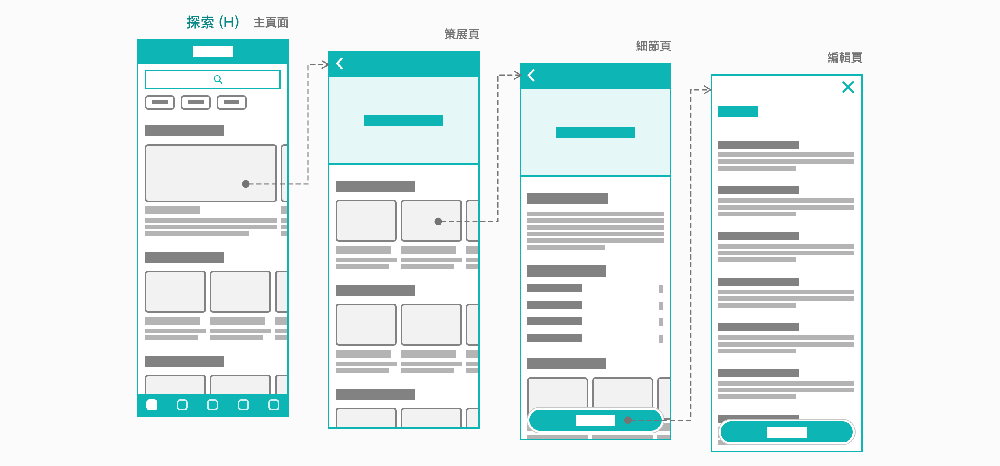
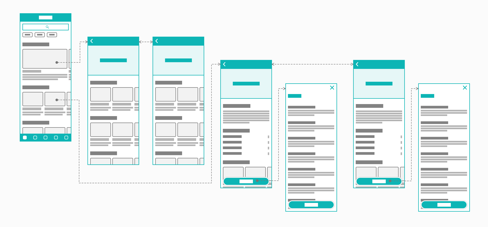
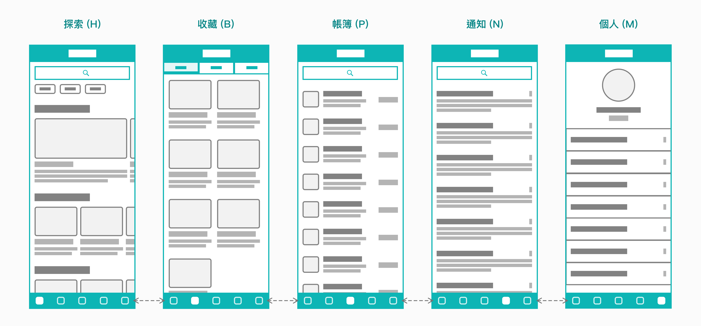
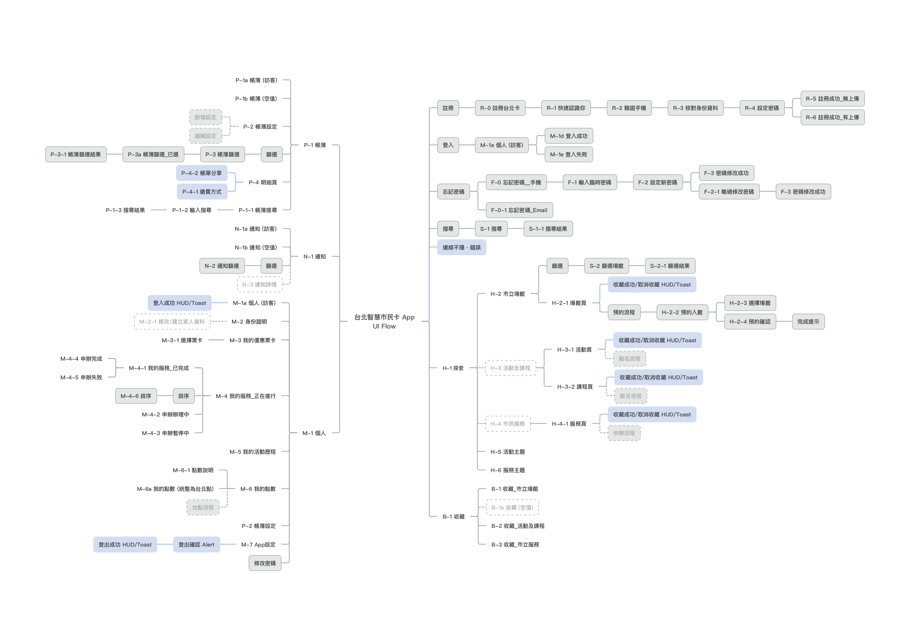

# 頁面

## 頁面是什麼？

### 構成 App 服務

一個頁面承載了服務與資訊，這些內容可以由幾項 [元件 \(Component\)](../component/) 組成。一個頁面會清楚地提示一個明確的使用目的，以讓使用者能夠直覺地完成當下的任務 \(job\) 或決定下一步動作。

### 呈現清楚的資訊架構

服務內容及資訊經過整理之後，分別安置於於個別頁面，呈現清楚的資訊架構。本 App 服務分別定義了「頁面層級」與「服務類別」，協助規劃者理解資訊架構及頁面結構的安排，並持續提供具備一制性的內容體驗。

### 提供可能的瀏覽動線

本 App 服務以 [底部標籤列 \(Tab Bar\) ](../component/untitled-1.md#di-bu-lie) 來做服務類別的快速切換，並以 [頂部導覽列 \(Navigation Bar\)](../component/untitled.md)  來進入該類別的上下層級。

## 如何組織頁面結構？

### 依「資訊範圍」定義頁面層級

為了幫助規劃者釐清使用目的的差異，規劃出相符的頁面內容，本 App 服務定義出 4 種頁面層級，方便規劃者能加以應用。這 4 種頁面層級最大的差異在於呈現資訊的 **細緻程度** 不同。層級越高的頁面應顯示範圍越廣的資訊，讓使用者快速瀏覽不同項目類別及項目。而層級越低的頁面應顯示範圍越小的資訊，只解釋單一項目的內容。藉由不同頁面層級的連結，可以組成不同的資訊結構及動線。

| 頁面層級 | 從屬 | 定義 | 主要內容元件 | Call-to-Action |
| :--- | :--- | :--- | :--- | :--- |
| **主頁面** | 第1層 | 羅列最新的資訊 | 牌卡及列表 | 搜尋或瀏覽 |
| **次頁面** | 第2層 | 羅列符合限定條件的資訊 | 主題說明、牌卡及列表 | 瀏覽 |
| **細節頁** | 第3層 | 詳細資訊內容 | 圖文、表格及連結等 | 收藏或進行流程 |
| **編輯頁** | 第4層       | 資訊調整、編輯、新增或刪除 | 步驟、輸入框及按鈕等 | 繼續、完成或離開 |

### 靈活運用頁面層級

* 主頁面 \(1\) 可同時連結至次頁面 \(2\) 及細節頁 \(3\)
* 次頁面 \(2\) 可連結至其他次頁面 \(2\) ，或進入細節頁 \(3\)
* 細節頁 \(3\) 可連結至其他細節頁 \(3\)，或進入編輯頁 \(4\)

## 如何安排服務內容？

### 依「動作目的」進行服務分類

依據使用者的「動作目的」來區分不同標籤的頁面。每一個標籤是為了不同的「動作目的」而設計。規劃者應瞭解每一個標籤主頁面的目的及內容，以維持新服務規劃的一致性。

### 以設計目標為準則

每個標籤頁都為了滿足特定的使用者動作來進行設計。接下來將分別就不同標籤頁來進行說明：

| 標籤 | 代號 | 動作目的 | 設計目標 |
| :--- | :--- | :--- | :--- |
| **探索** | H | 瀏覽資訊 | 讓使用者盡情探索並認識市府服務（含場館、活動、課程及服務申辦\) |
| **收藏** | B | 蒐集資訊 | 讓使用者能擁有個人化版面以對應服務的使用頻率及所需準備時間 |
| **帳簿** | P | 核對帳目 | 讓使用者能查閱各項帳單繳費情況 |
| **通知** | N | 接收訊息 | 讓使用者直接收到與個人服務相關的通知 |
| **個人** | M | 確認個資 | 讓使用者隨時可以回顧自己的行動狀態及歷程，並可調整設定 |

## 本 App 服務的頁面結構 \(UI Flow\)

UI Flow 藉由命名頁面、替頁面編碼，以樹狀圖呈現頁面間的層級與關聯性，能說明本 App 服務規劃的頁面結構。



