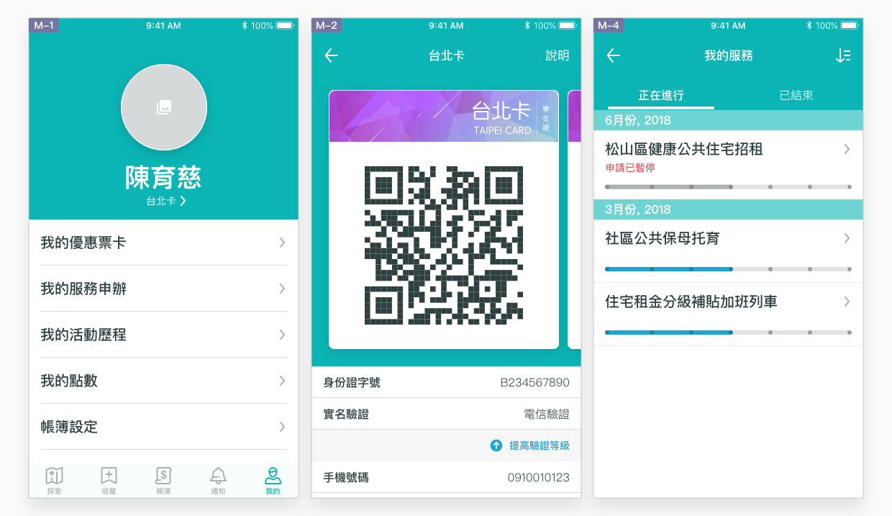
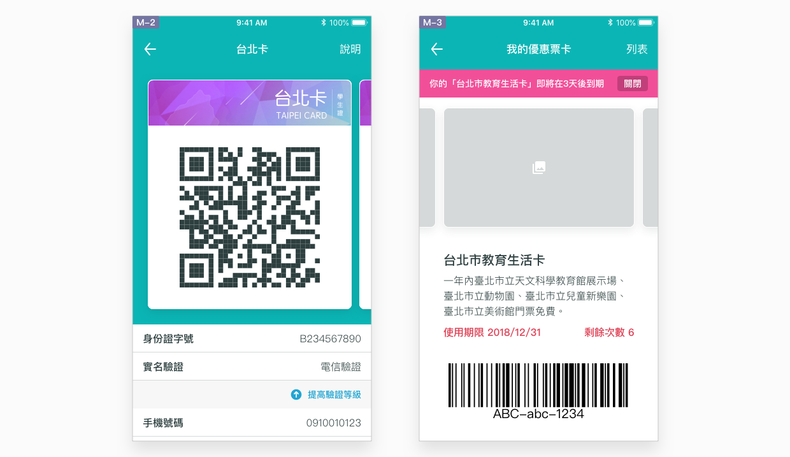
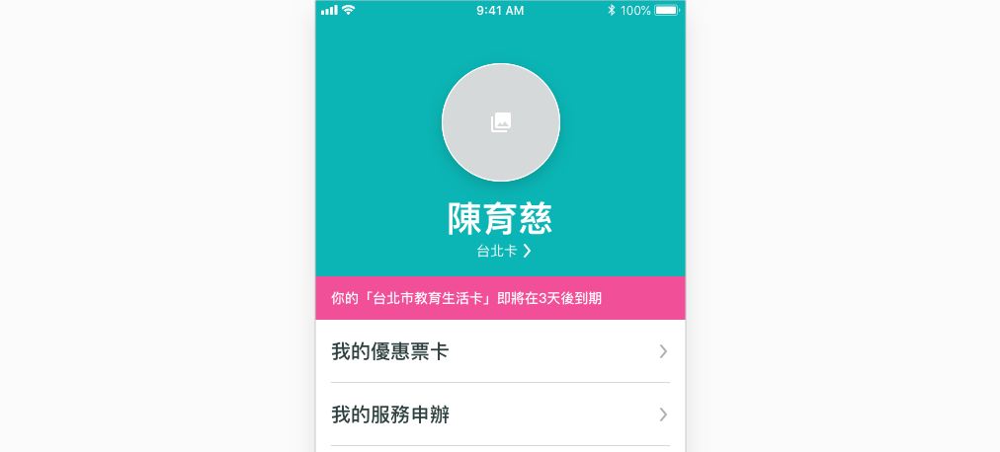
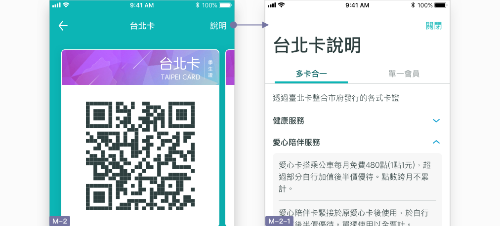

# 個人

## 利用個人頁，集中管理身份與帳號

使用者可依據使用其他 App 服務的經驗，延續慣例，憑直覺到個人頁尋找**身份證明、行為記錄、帳號管理與設定**等功能。本 App 服務中，個人頁條列出以下幾項功能入口，依使用頻率由上而下排列：

* **台北卡相關卡證：**證明自己身份所需的條碼、卡面及個人資訊
* **我的優惠票卡：**使用者已購與未購的優惠票卡，需使用時已於此進入
* **我的服務申辦：**追蹤使用者已申辦的服務進度，記錄已申辦結束的服務內容
* **我的活動歷程：**記錄使用者已報名的活動及課程
* **我的點數：**以台北卡蒐集的所有點數明細
* **帳簿設定：**管理帳簿出現哪些帳單
* **綁定悠遊卡：**管理綁定台北卡的悠遊卡
* **修改密碼：**管理台北卡帳戶的密碼
* **App 設定：**管理 App 推播通知、App 相關資訊，以及帳戶登出

## 如何達成良好的帳號體驗？

### 以「我的」概念溝通及規劃

使用者應對自己的身份資訊、卡證狀態、歷史紀錄及 App 設定等有很強的主控性，這些資訊具備實名性質、私人且十足個人化。因此相對於傳達公開資訊的探索頁及收藏頁，個人頁應盡量以第一人稱視角「我」來作溝通，加強個人專屬性質。

### 分辨卡片使用情境

用作身份證明的卡片與付費購買的卡片，不僅申請方式不同、使用規範不同，使用期限也有所差異。將所有卡片歸納於一處雖然方便，但內容雜亂，使用者難以認知使用。規劃者於整併新卡片的同時，應考慮該卡片的特性，加以分類區別：

* **台北卡：**為取得特定服務所需之身份證明，使用時可能需查閱使用者本人的真實身份資訊
* **優惠票卡：**短期持有的優惠卡，以點數消耗或以一定時間為限，專屬於特定場館所提供的服務，由場館進行系統性管理。

### 狀態變化的更新與提醒

個人頁的資訊應是專為使用者本人提供的，適時地以 [提示](../component/jing-gao-ti-shi.md) 提醒狀態變化，可以幫助使用者於缺乏線索的畫面中快速掌握最新進度。要注意的是，過多的提醒將降低使用者的警覺性，一項資訊應避免於短期內提供過多的提示，而是依循「**告知服務即將結束**」為準則，幫助使用者整理最新資訊，分別顯示於相關頁面，例如：

* **台北卡頁 \(M-1\) 提示**：優惠票卡到期、服務申辦結束
* **我的優惠票卡 \(M-2\) 提示：**優惠票卡到期
* **我的點數 \(M-6\) 提示**：點數到期

### 隨時可查閱的詳細說明

使用者在註冊本 App 服務時，不一定就會理解服務內容、也不一定能全部理解。因此與使用者自身權益有關的資訊內容，應易於尋找，並維持在最新的版本。除了於 App 設定中列出服務條款之外，「台北卡」與「台北點」頁分別也應提供說明頁面的入口，讓使用者能夠隨時查閱。

