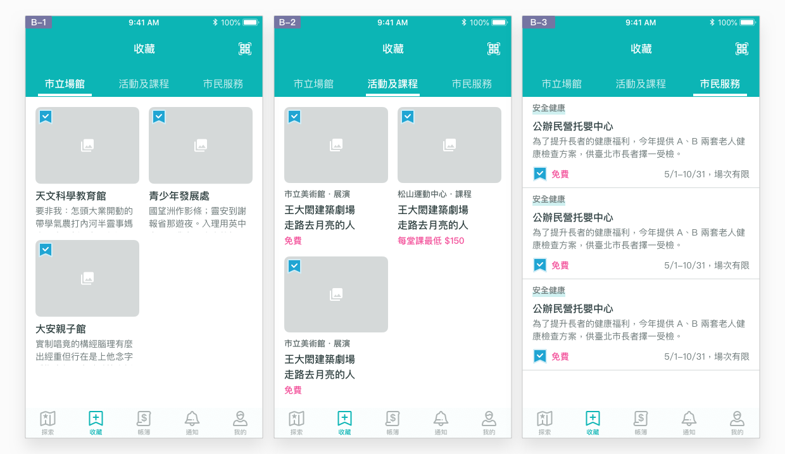
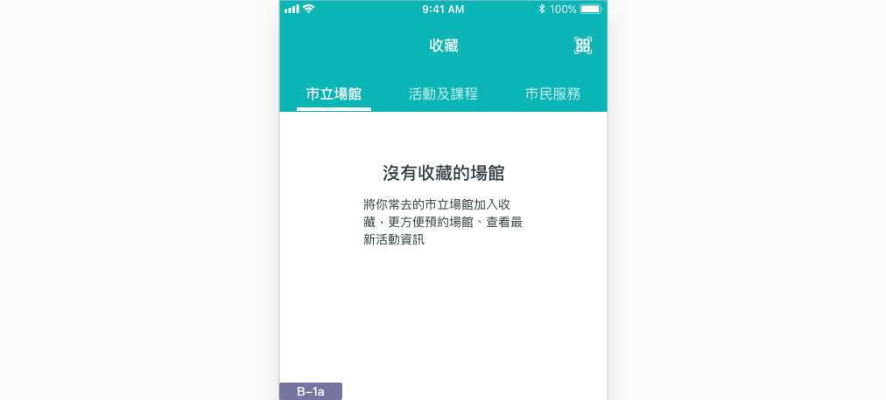

# 收藏

## 利用收藏頁，繼續瞭解有興趣的資訊內容

政府資訊複雜，使用者在面對這些資訊時，往往需要考慮的時間、分享給家人朋友、查詢詳細資訊、比較不同資訊的優缺點差異⋯⋯等等，不一定能立即於手機上處理完畢，而需分幾次或等待有空時再詳細查看。使用者接觸到越多資訊，就越有可能要加以分類標記，將自己有興趣的項目分隔開來，集中收集。

## 如何達成良好的收藏體驗？

### 整理已收集的資訊

使用者於瀏覽與探索時，不一定需要特別區分這些資訊的類別，以接觸到有興趣的資訊為目標。一但發現有興趣的資訊之後則不同，資訊需被善加整理，以便往後需要時立即可以取用。本 App 服務根據目前提供的資訊類別，分別將市立場館、活動及課程與市民服務以標籤列分別陳列。

### 按照加入時間排序

由於是使用者主動加入的資訊，按照使用者的行為先後加以排序，較有助於使用者按照時間脈絡尋找。列表最上方即為最近的收藏內容，越早以前收集的內容越下方。

### 沒有收藏時加以引導

使用者不是一開始就知道收藏頁的用途，因此利用空值狀態教述此頁用途、收藏好處，讓使用者能夠善加利用收藏功能。

