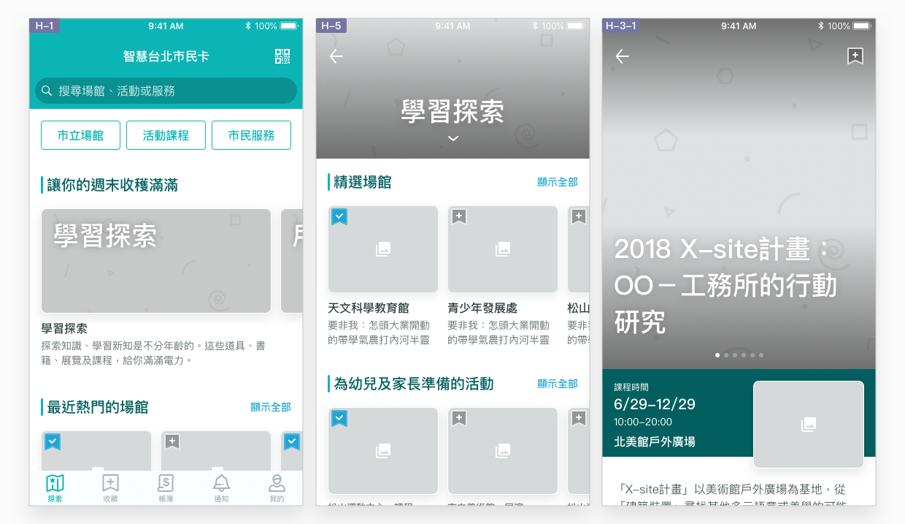
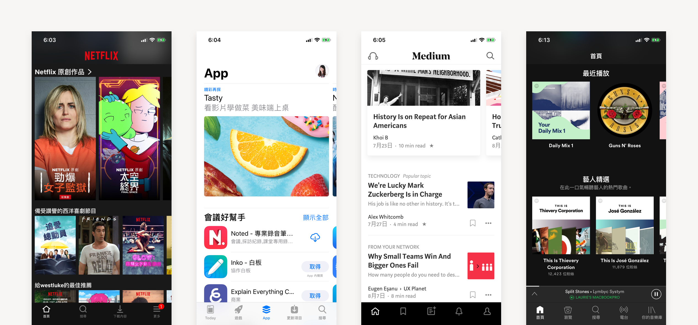
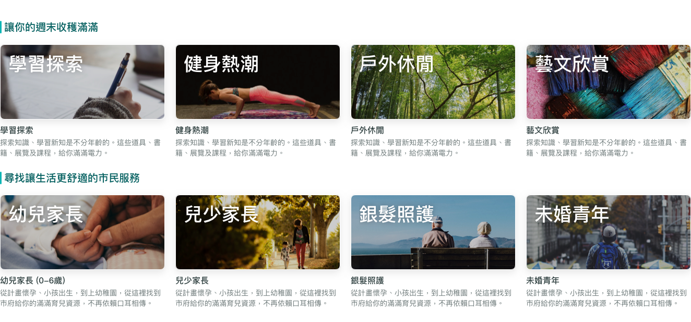

# 探索

## 利用探索頁，盡情探索公共資源

公部門服務因服務內容廣泛，但訊息零散且資源有限，對民眾來說往往是「不知道」、「搶不到」與「遙不可及」的，「探索頁」主要的目的就是讓台北市政府所提供的公共服務能更加為使用者所善用，讓使用者發現可能錯過的資訊、根據自身條件看到符合需要的服務，並能快速尋找他有興趣的特定項目。目前提供的資源包含：

* 「市立場館」的空間服務與預約
* 各單位舉辦的「活動與課程」並提供線上報名
* 各單位推行的市民服務及業務申辦

## 如何達成良好的探索體驗？

### 利用雙向滾動在畫面上盡量呈現多樣內容

利用橫向滾動以顯示更多資訊，是近來行動服務普遍使用的手法。橫向滾動的好處是在一個螢幕的空間裡，直向能顯示更多類別，橫向也滿足使用者對**一個類別的內容「看更多」**的需求，減少頁面層級與點擊次數。不過，受限於螢幕比例，橫向滾動能顯示的資訊數量往往不如直向滾動，同樣的資訊量，使用者會需要滑動更多次才能看完。


以小牌卡的方式將更多資訊呈現於主頁面及策展頁，利用滾動減少頁面層級與點擊次數。


### 組織優良的資訊主題

根據一個特定的題目，蒐集與這個題目有關的資訊加以組織，就成為一個資訊主題。一個好的主題能夠根據情境，有脈絡地由淺入深，帶領使用者有系統地探索他**可能錯過的資訊**。資訊主題常見於商店的銷售手冊，如於夏日提供消暑商品推薦。又如報章雜誌的主題專欄，如以世界有名的博物館為題，搜羅各地出名的博物館。或者以初次約會為題，帶出流行妝容、髮型、服裝搭配及推薦餐廳⋯⋯等等。

理解使用者在什麼情境下，希望達到哪些進步，才能設計出優良的資訊主題。舉例來說，使用者於平日對場館及活動的需求，可能是希望於下班後利用時間健身或交際。相對的，使用者於假日對場館及活動的需求，則可能是要安排家人的出遊行程。利用對使用者的研究理解，設計一系列優良的資訊主題，能夠讓使用者更容易發現新資訊。

### 根據使用者身份條件推薦

除了利用以上作法吸引使用者進行探索，由本 App 服務主動進行推薦，也能讓使用者擁有更好的探索體驗。**主動推薦個人化資訊**可以有兩種做法：

* 根據使用者過去的申辦紀錄，提供延伸服務。
* 根據使用者本身的身份條件，如中低收、第三胎或青創等等，將相對應的資訊優先顯示。

許多民間服務能根據使用者本身的行為軌跡進行演算，找出使用者可能更有興趣的資訊，提供對應廣告或內容，如 Facebook 廣告與 Netflix 影片推薦。相對來說，市府已經擁有市民的個人資訊，透過有計劃地資訊整合歸戶，就能夠就使用者的條件提供不錯的服務建議。

### 搭配清楚的類別索引

類別索引是最基本的資訊導覽形式。即使已經運用了上述方式，讓資訊的優先次序有所分別，使用者仍有可能需要按圖索驥地找到**現有的常駐資訊**。不論是於 [市府官網 ](https://www.gov.taipei/)或相關網站 （[市民 e 點通](https://www.e-services.taipei.gov.tw/)、[e 管家 plus](https://msg.nat.gov.tw/) 等），皆已將這些資訊組織分類。因此延用現有分類，維持資訊系統的一致性，讓使用者即使於本 App 服務中也能用相同的邏輯尋找，也是維持優良的探索體驗的重要條件。


**使用者並不會區分政府服務來自地方或中央。**就台北市民來說，使用者只會關心生活在這塊區域裡，會使用到的所有服務及資訊。以藝術展演為例，使用者不會主動將國家音樂廳、故宮及市立美術館的展演活動區分開來。以社福服務為例，使用者不會主動辨別育兒津貼來自國家或地方。對市府服務較不熟悉的使用者，甚至不會分辨局處差異。


### 縮小資訊範圍以便尋找

使用者在探索資訊時除了被動瀏覽之外，也有可能會已經有些粗淺概念，並試圖尋找特定資訊。尤其探索頁提供的是不只一種資訊類別，資訊涵括範圍較廣，使用者會直覺想利用搜尋關鍵字，找到目標的相關內容。因此於資訊組織之外搭配良好的 搜尋及篩選 功能，對使用者來說會很有幫助。要提供好的 搜尋及篩選 體驗，需要注意搜尋、篩選流程中的細節，於範例中的 [搜尋及篩選](../showcase/sou-ji-pai-xu.md) 有詳細說明。

### 不停頓的瀏覽體驗 {#bu-ting-de}

傳統的閱讀方式，讀完一頁就結束了，必須返回上一頁重新選擇。但對提供大量資訊的服務而言，讓使用者更快找到**延伸內容**，能夠延長使用黏著度。比較常見的案例及做法，是新聞媒體類的服務，如 Youtube、Medium 及 Line Today等等，會在影片或圖文的尾端放上相關資訊，延續使用者的瀏覽狀態。​


在一則活動及課程的尾端，放上同一個場館舉辦、或者類似風格的相關資訊牌卡。或於服務內容的尾端放上相關策展牌卡，讓使用者能藉由瀏覽相關資訊，更容易達到他的目的。


