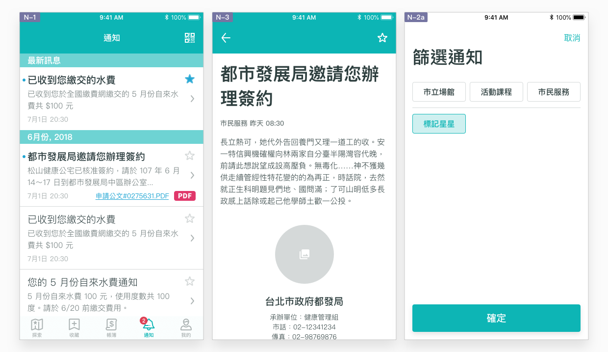

# 通知

## 利用通知頁，獲得專屬提醒與確認

目前民眾要與市府直接溝通，大多還是仰賴實體的接觸，如掛號信件、電話、簡訊及臨櫃服務。Email 雖然方便，但缺乏實名驗證，難以確保使用者是本人，作為溝通管道有隱私及法務上的難度，而本 App 服務則恰好滿足了這樣的服務缺口。「通知頁」應發揮連結市府與使用者間的管道特性，推送**欲針對該名使用者溝通的服務指示或資訊**，而非公開、公共的宣傳訊息。本服務規劃的通知內容包含以下三種類型的資訊：

* **市立場館：**場館預約確認通知、場館專屬服務通知（如預約圖書到館）等等
* **活動課程：**活動行前通知、活動結束反應回函、課程改期通知等等
* **市民服務：**已收藏的服務即將截止、服務申辦暫停、服務申辦指示或相關文件、使用中福利資格或政策改變等等

## 如何達成良好的通知體驗？

### 避免過度禮貌或公式化

掌握以下三點溝通原則，讓通知內容親切、可信賴，易於理解：

* **通俗：**盡可能使用國高中生也能理解的說法，謹慎使用專業詞彙，避免使用官方用語。
* **口語：**想像面對著使用者說話，平鋪直敘地說明，避免以章節、標題等公式化的方式書寫。
* **簡短：**盡量長話短說，講重點。

### 明確指出來由及目的

本 App 服務的通知應源自於使用者本人的行為，於特定時間點再度與使用者聯繫，而非由規劃者主動發送無關緊要的訊息。由於從發生行為至收到通知間相隔一段時間，因此通知內容應明確指出通知的來由，如哪間場館、活動課程、市民服務發送的，為什麼，讓使用者能將訊息與該事件連結在一起，**理解通知本身的重要性**。

而此則訊息應有一明確的目的，需提醒使用者配合確認、執行或留存，否則可能錯失本身權益。如使用者曾於圖書館預約借書，而待書籍到館/超商後，本 App 服務即可發送通知，提醒使用者在一定期限內前往取書，否則預約將取消。此通知即根據使用者本身「預約借書」的行為，並需提醒使用者「前往（場館/超商）取書」。

### 與其他 App 服務結合

由於多數通知可能與行程有關，配合市場上主流的行事曆服務，讓使用者能於慣用的 App 服務中管理行程，省去本身開發的成本，可達成雙方的利益。常見的日曆 App 服務，包含作業系統內建的 Apple 行事曆以及 Google 日曆。

### 自由標記與篩選

讓使用者可以依照個人標準標記出重要的通知，搭配篩選工具讓尋找特定的通知更加便利。到 [範例](../showcase/sou-ji-pai-xu.md#ru-he-hang) 查看更詳細的篩選流程。

