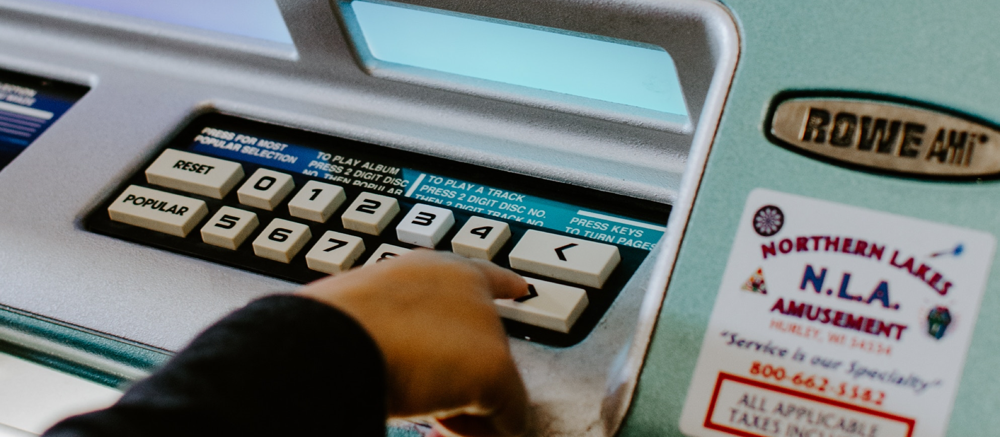

# 使用體驗設計原則 Design Principles

## 『台北卡 App 』的價值主張

透過使用者研究發現，台北市市民所期待的數位服務是以『主動推薦、持續互動』的方式，透過個人化的服務入口，來觸及跟享受透明、可信賴的市政服務。

* **主動推薦**
* **持續互動**
* **透明可信賴**

## 原則 \#1 **讓資訊可以被使用者精準觸及、流暢閱覽**

將市府的各種服務資訊精準的佈達給有需要的民眾是『台北卡 App』主要價值之一。然而，由於市府的業務性質極為多樣，導致資訊的種類眾多，因此，在設計『台北卡 App』的內容瀏覽體驗時，應把握以下兩大重點：

* **類別區分應盡量明確，避免使用「其他」作為類別**
* **連續不斷的順暢瀏覽**

💡除了以上設計原則重點，資訊內容的投遞方式等也值得服務規劃者以及開發人員進一步的優化，才能真正完善整體的使用體驗。

## **原則 \#2 讓內容可以被使用者有效理解、輕鬆對應**

市府服務所需要溝通的資訊量甚多，而且同一份內容，必須要讓廣大的市民不分教育程度、專業背景，都能夠充分理解，形成共同一致的認知。因此，在設計『台北卡 App』的內容瀏覽體驗時，應把握以下兩大重點：

* **運用主題策展來強化服務脈絡**
* **避免使用含義模糊的圖片或圖示**

💡除了以上設計原則重點，內容上稿的規則以及上稿系統對內容樣式的支援度也值得服務規劃者以及開發人員進一步的優化，才能真正完善整體的使用體驗。

## **原則 \#3 主控性高、輕便效率的流程操作**

接續資訊的佈達，引導民眾到對應資訊的流程，順利的執行下一個步驟，或是引導民眾到其他可對應的接觸點是『台北卡 App』另一重要價值。然而，由於市府的業務性質極為多元，接續各種資訊內容的流程也相當多樣，因此，在設計『台北卡 App』的流程操作時，應把握以下兩大重點：

* **讓步驟清爽明確而非純粹精簡數量**
* **一切都與使用者本人「我」有關**

💡除了以上設計原則重點，針對登入、驗證的方式的優化以及善用資料自動帶入等手段通常對於改善繁複的操作流程有顯著的效果，值得服務規劃人員與開發人員深入考量。

## **原則 \#4 容易理解、可預期的互動反饋**

市政服務本質上就應該是容易親近，可預期的，有信賴感的。這樣的原則特性當然也會充分展現在數位服務上，讓整體的服務能夠很容易被理解，有一致性的互動體驗，而且能夠從中獲得合理可預期的回饋。因此，在設計『台北卡 App』的流程操作時，應把握以下兩大重點：

* **保持體驗的一致性**
* **提供合理的動作反饋**

💡除了以上設計原則重點，針對流程規劃清楚的分類與相對應的模組除了可以有效把關操作流程的一致性，亦有助於規劃、設計與開發的效率，值得服務規劃人員與開發人員深入考量。

