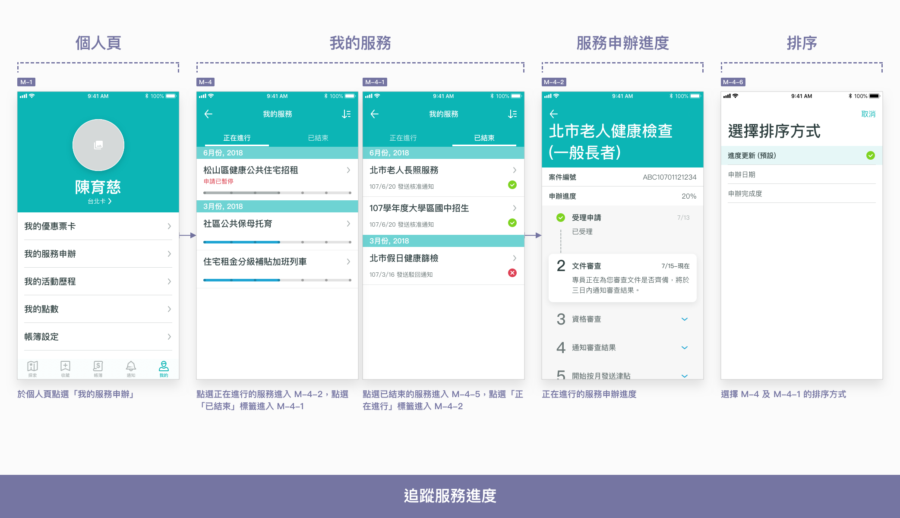
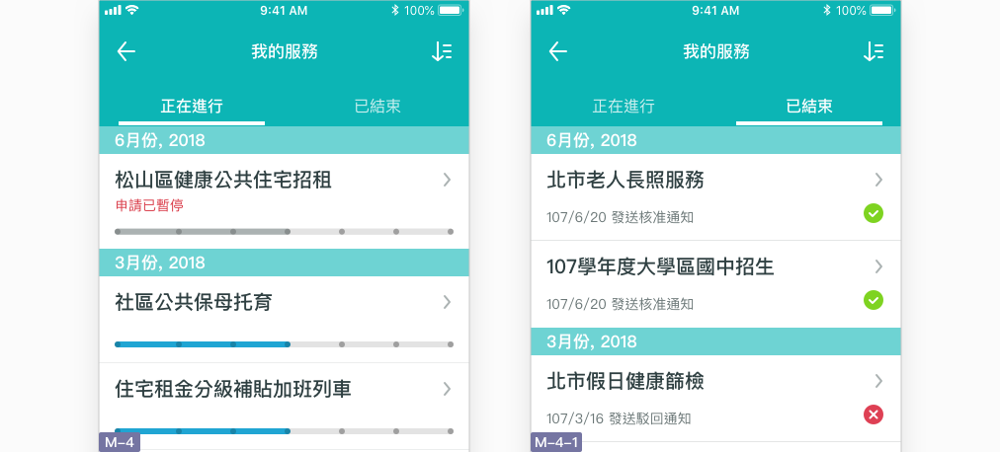
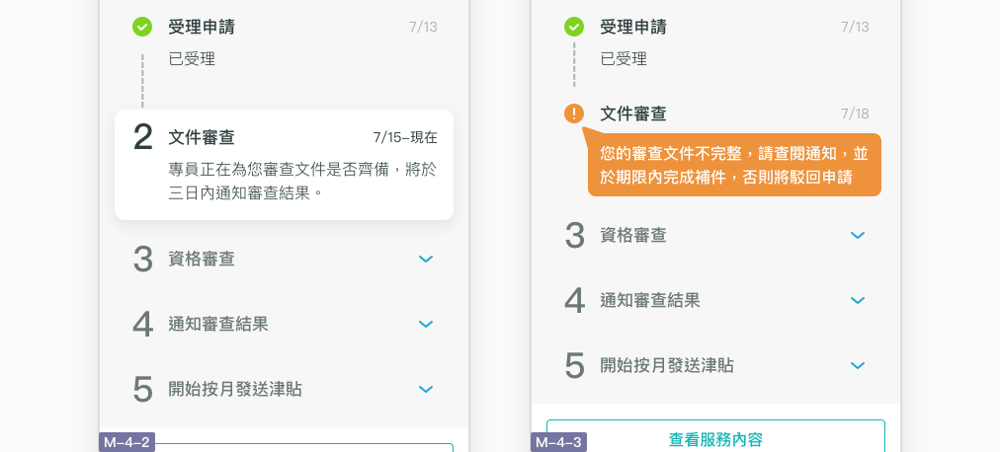
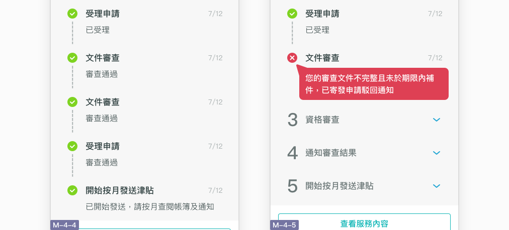

# 追蹤服務進度

## 如何追蹤服務申辦進度？

### 從列表看出案件進度

使用者除了可以追蹤正在進行的服務之外，已結束的服務申辦也皆有留存紀錄，以便存查。我的服務頁以頂部標籤列切換，可檢視不同狀態的服務列表，分為**正在進行** M-4 及**已結束** M-4-1。正在進行的列表顯示服務名稱及進度條。進度條會顯示該服務共有幾項手續，目前進行到其中第幾項。而已結束的列表顯示最後一項手續的更新日期。點選服務可進入申辦進度頁，查看進度細節。

| 服務進度 | 申辦進度頁 | 進度描述 | 服務狀態 |
| :--- | :--- | :--- | :--- |
| **處理中** | M-4-2 | 市府正在處理，若順利會自動進入下一個手續 | 正在進行 |
| **已暫停** | M-4-3 | 正在等待申請人補足手續、費用或文件 | 正在進行 |
| **成功** | M-4-4 | 所有手續處理完畢，已申請成功 | 已結束 |
| **失敗** | M-4-5 | 申請人不符合資格，已結束申請 | 已結束 |

### **個人化的進度細節**

使用者對於**正在進行**的服務，關心的不只是進度到哪裡，而是自己能不能順利申辦完成，甚至於能不能在某段時間內完成。因此進度細節除了顯示該服務共有幾項手續、目前手續進度之外，也須站在使用者的角度，提供明確的申辦狀態，例如：

* **已結束手續結果：**完成狀態如何？如果有問題，為什麼？使用者要如何處理？
* **目前手續狀態：**目前誰在處理？處理什麼？預估結束時間是多久？
* **未來手續準備：**讓使用者托善安排行事曆，以免遇到有事或出國而無法處理。

### 告訴我申辦結果及原因

若服務申辦結果是成功的，使用者需要知道自己實際將擁有哪些權益。若服務申辦結果是失敗的，使用者也會想知道原因為何。

### 於必要時發送通知

避免過度使用通知，僅在需要使用者配合處理時才發送通知，顯示於通知頁 N-1。舉例來說，發生以下狀況時可以使用通知：

* 服務申辦遇到狀況而需暫停
* 結束一項手續後有重要文件需留存
* 進入新一階段的手續需要使用者配合
* 申辦結束



