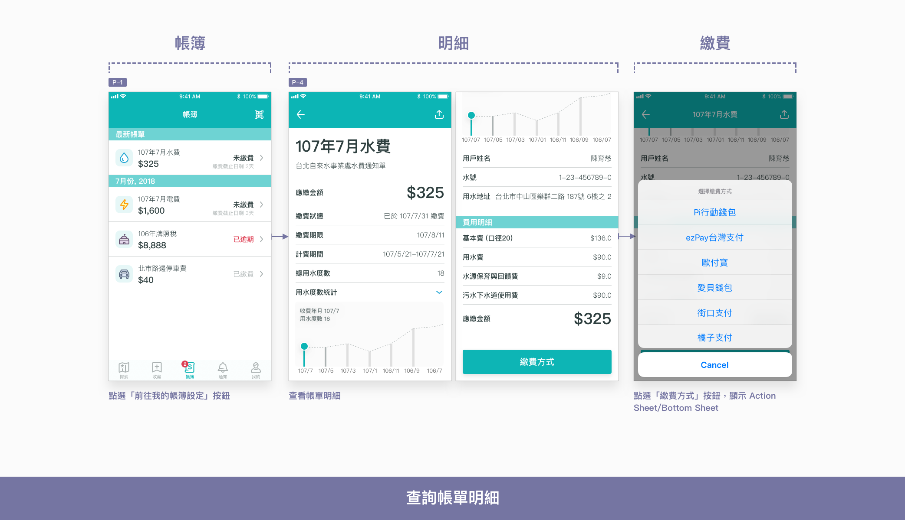
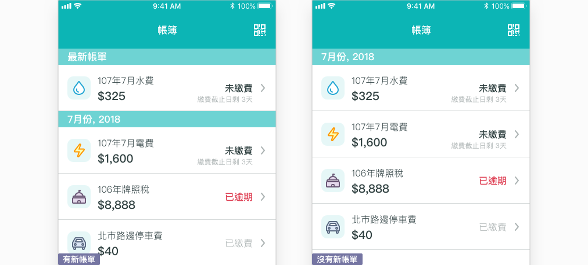
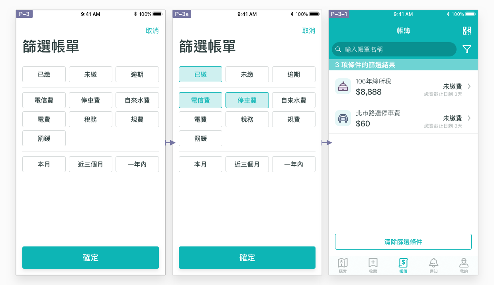
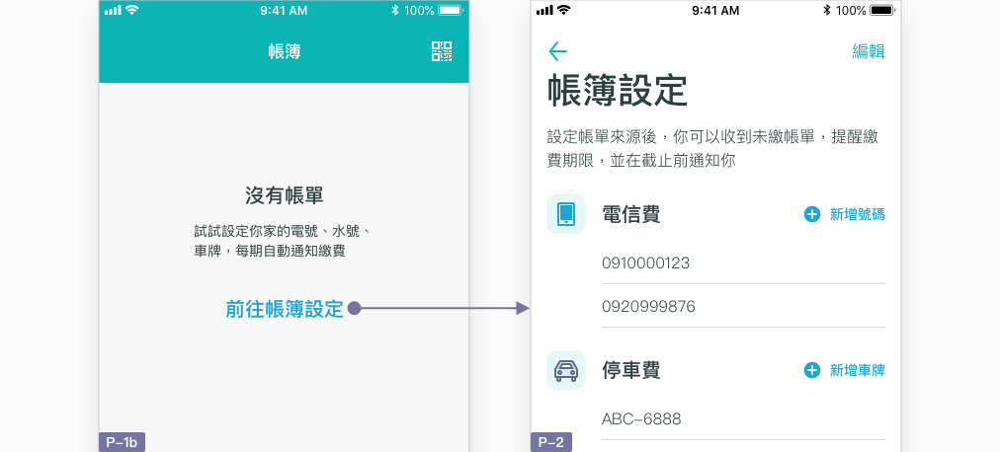
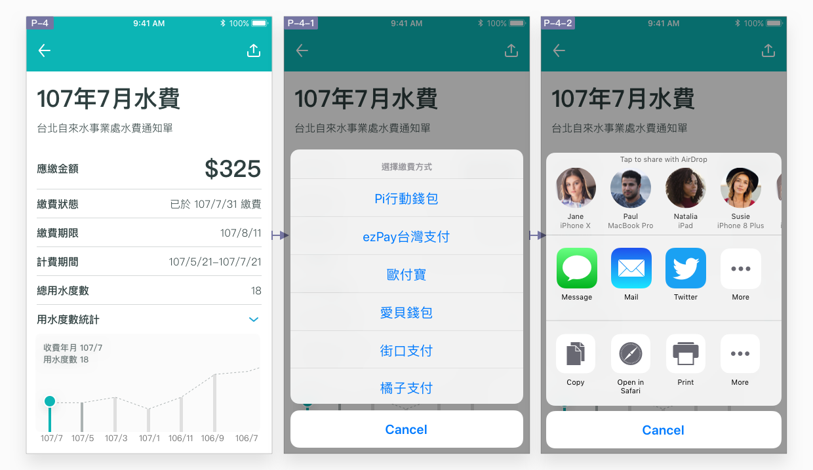

# 查詢帳單明細

## 如何查詢帳單明細？

### 新帳單到來時通知

收到新帳單時，於標籤列以 Badge 顯示未讀帳單數量，並按使用者的設定決定是否發送推播通知（預設發送）。與 [通知頁](../pages-1/tong-zhi-n.md) 相同，當使用者離開帳單頁 \(P-1\) 後這段時間內收到的所有新帳單，都算未讀新帳單，並與已讀帳單以列表的 [分類標題](../component/untitled-4.md#fen) 區分。使用者打開帳單頁後，所有帳單皆由本 App 服務標記已讀，於下次打開帳簿頁時重新計算。


**最新帳單：**距離使用者上次打開帳簿頁之後收到的所有新帳單。


### 利用搜尋及篩選工具尋找

帳單預設以寄送時間由新至舊排序，易於查看最新帳單。唯帳單種類眾多，如使用者需要比較同一帳單於不同月份的費用、一次查看所有未繳帳單，或者尋找特定一張帳單，單從時間序去尋找未免太沒效率。因此，帳單頁與通知頁相同，均有隱藏的搜尋框及篩選工具，下拉畫面後即顯示於導覽列下方。篩選工具提供可複選的篩選條件，例如選擇「已繳」、「電信費」、及「停車費」三個條件，則顯示符合「已繳電信費」及符合「已繳停車費」之所有結果。搜尋框則讓使用者可輸入帳單名稱進行搜尋（可參考 [一般搜尋](sou-ji-pai-xu.md#ru-he-hang-yi-ban-sou)）。

### 引導設定帳簿

當帳簿尚未有任何帳單資訊時（空值），使用者應能藉由點選「前往帳簿設定」按鈕，進入帳簿設定頁 P-2，新增號碼、車牌、水號及電號。以電信費作為範例，使用者點選「新增號碼」按鈕，即可進入電信費新增流程。點選「編輯」按鈕，即可刪除已設定的號碼。

### 帳單明細

帳單明細頁提供的事該費用帳單的詳細明細，包含應繳金額、繳費期限，以及繳費狀態**。**帳單除了顯示資訊細節之外，應能讓使用者執行兩項動作：

* **繳費：**使用 Action Sheet 顯示 Pay.taipei 所支援的繳費方式，使用者點選後即打開該 App 繳費頁面。避免讓使用者重新設定及繳費項目及金額。
* **分享或儲存：**使用 Share Sheet 讓繳費帳單能供使用者分享給他人或儲存備用。



