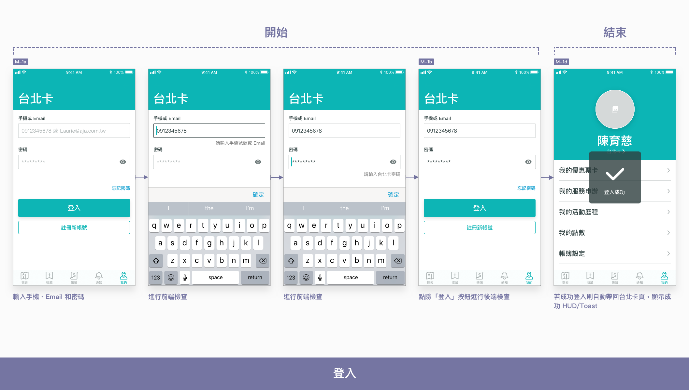
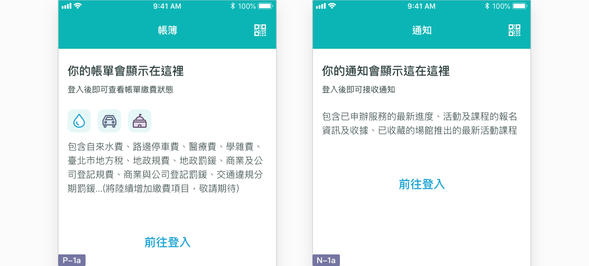
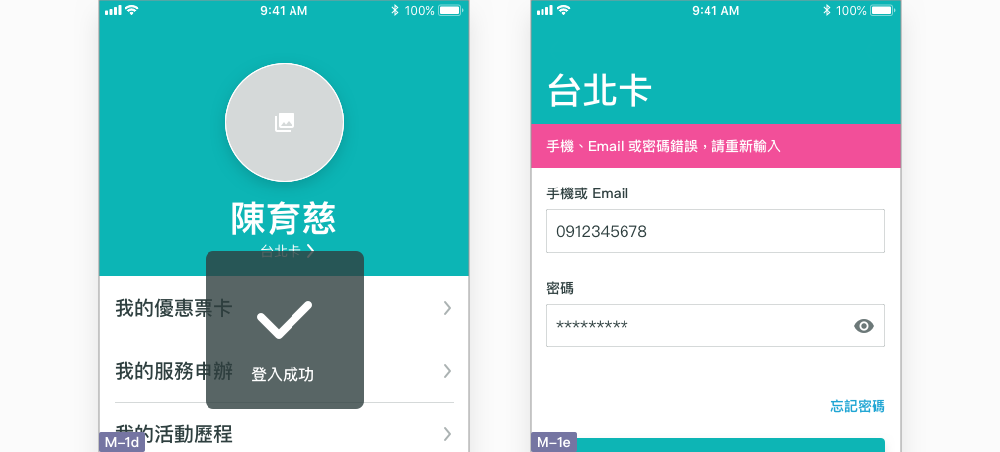
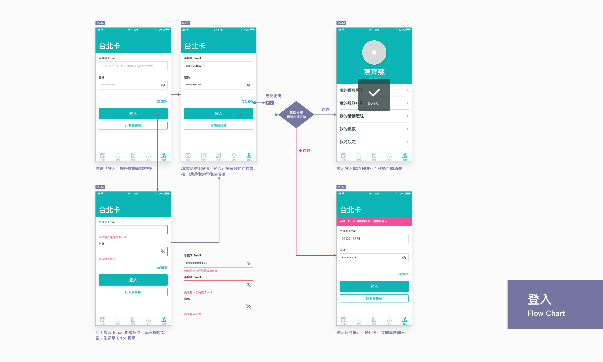

# 登入

## 如何登入台北卡帳戶？

### 於「個人頁」登入

本 App 服務不必登入也可以瀏覽及收藏，但若要使用個人化的服務，就需要登入台北卡帳號。不論使用者是在本 App 服務上以手機號碼註冊，或是經由台北卡官網以 Email 註冊，都可以從訪客狀態的個人頁 \(M-1a\) 輸入帳號（手機或 Email）及密碼，進行登入。


登入流程相當簡單，輸入帳密後點選「登入」按鈕，即判斷輸入資訊是否正確，並顯示登入結果。


### 從其他標籤頁引導登入

本 App 服務共有三個標籤頁提供個人化的服務「[個人頁](../pages-1/ren-m.md)」、「[帳簿頁](../pages-1/bo-p.md)」及「[通知頁](../pages-1/tong-zhi-n.md)」。若使用者未登入，除個人頁外「帳簿頁」及「通知頁」亦有訪客狀態，說明：

1. 登入後可使用的服務內容
2. 「前往登入」按鈕引導至個人頁 \(M-1a\) 登入。

### 顯示登入結果

登入於點選「登入」按鈕且通過前端檢核後觸發，並以頁面中 [提示](../component/jing-gao-ti-shi.md) 的方式顯示：

* **登入成功 \(M-1d\)：** 檢查使用者所輸入的帳號與密碼，正確則通過檢核，重新整理個人頁為已登入狀態，並顯示成功 HUD/Toast 訊息 \(M-1d\)，過一秒後消失。
* **登入失敗 \(M-1e\)：** 檢查使用者所輸入的帳號與密碼，錯誤則不通過檢核，顯示錯誤提示 \(M-1e\)。

## Flow Chart



