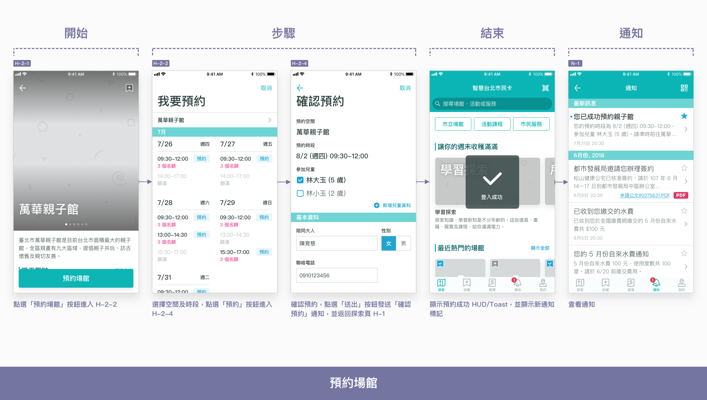
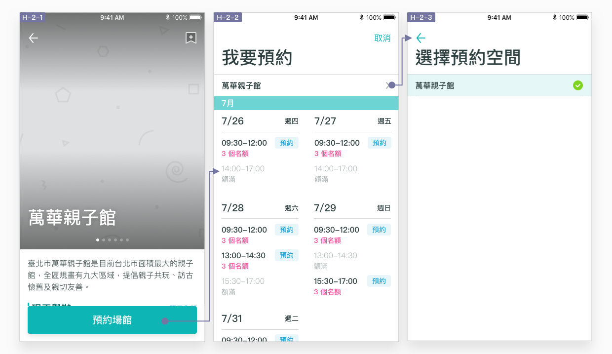
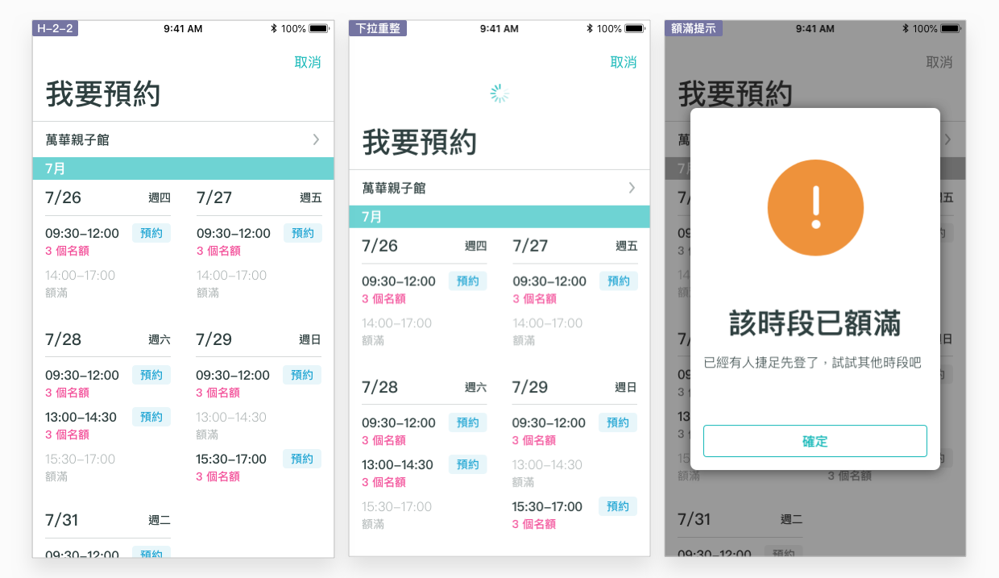
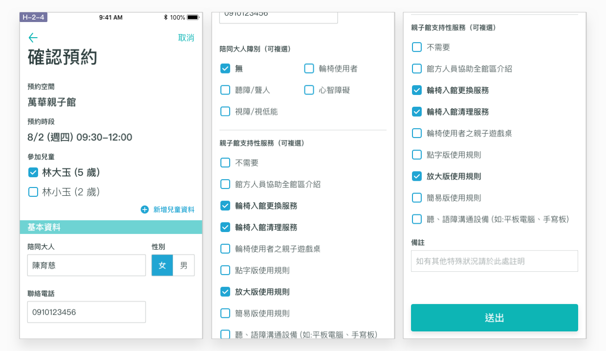
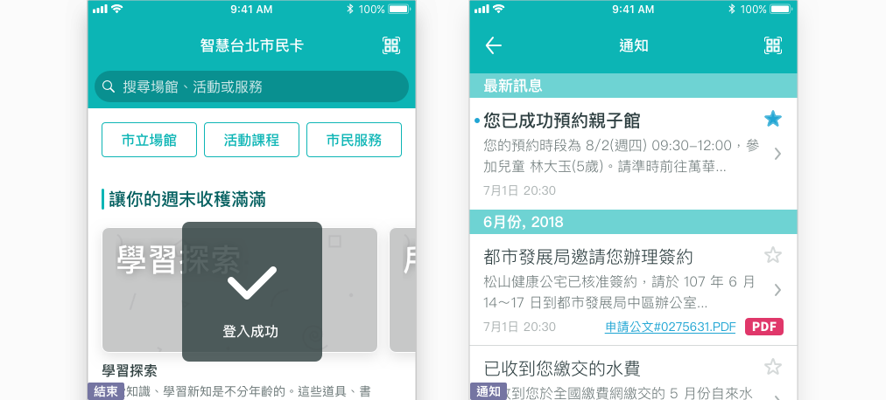
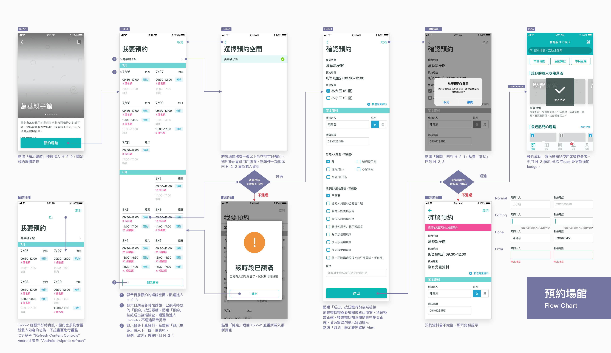

# 預約場館

## 如何預約市立場館？

### 於「探索頁」找到場館，開始預約

每間場館都有不同的開放空間，預約場館可以是預約入館/入園，或者是預約場館內的獨立房間及空間。使用者可以於本 App 服務中瞭解每一間場館的特色、空間圖片及設施介紹後，點選「預約場館」按鈕開始預約。使用者可以按照步驟完成流程，由本 App 服務發送通知，讓使用者留存查閱。

### 提供即時的預約細節

由於場館空間屬於有限資源，使用者往往需要提前「搶位子」，因此資訊的即時性相當重要。本 App 服務讓使用者於預約細節頁 H-2-2 確認查看預約空間、日期、時間及即時餘額，點選「預約」暫時劃位並繼續。好的即時資訊體驗至少應包含以下兩種工具：

* **下拉重整：**畫面下拉以重新載入資訊，已額滿的時段需隱藏「預約」按鈕。
* **額滿提示：**若於重新載入前即已預約額滿，此時使用者點選「預約」按鈕即會出現額滿提示，點選提示上的「確定」按鈕後重新載入資訊。

### 確認預約並填寫資料

使用者先預約劃位後，才能安心填寫資訊、確認預約。確認預約頁 H-2-4 除了顯示使用者已劃位的預約細節之外，可請使用者補充填寫預約資訊，並進行前後端判斷及提示。若使用者點選「送出」按鈕，即完成預約。相對的，若使用者於此時點選「取消」放棄預約，即釋出預約名額。

### 結束並通知

使用者完成預約後，應帶回探索頁 H-1 顯示預約成功提示 \(HUD/Toast\)，並發送一則新通知，供使用者後續留存，確認預約資訊。


場館、活動及課程的預約成功通知，應搭配 「加入行事曆」的功能，讓使用者能將服務資訊加入自己慣用的行事曆 App




## Flow Chart



