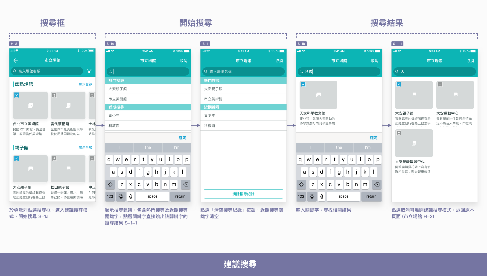
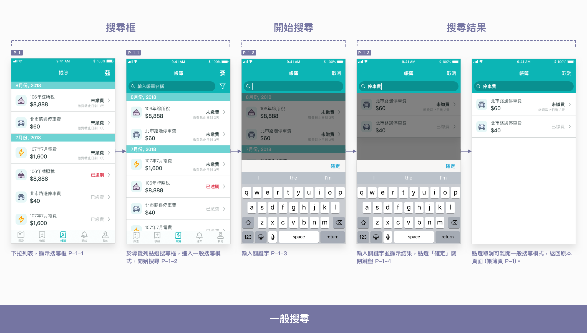
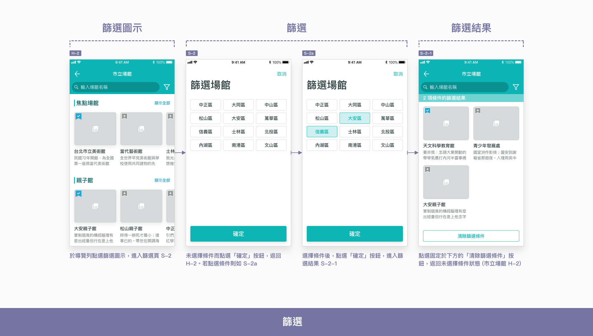

# 搜尋及篩選

## 怎樣打造好的搜尋體驗？

### 使用民間常用名稱也找得到

使用者習慣使用關鍵字搜尋，唯民眾常用的稱呼不一定與官方名稱相同，因此應考慮使用者輸入的關鍵字，如「樂齡」、「高齡」、「長輩」、「老人」及「銀髮」等，建立相似字詞串。讓使用者即使輸入民間常用的用語，也能找到官方以正式名稱命名的資訊。

### **輸入關鍵字前先提示**

讓使用者在進入搜尋模式後立即先看到建議項目，能提供搜尋的捷徑，節省使用者輸入關鍵字的力氣。尤其避開每次要尋找同一項目時，重複輸入關鍵字的困擾。常見的建議項目有：

* **熱門關鍵字：**參考其他人的搜尋內容
* **近期關鍵字：**看自己搜尋過的內容，方便重新查找

### 搜尋結果分類排序

本 App 服務提供之資訊種類多樣，和音樂及商城類型的 App 相似。若搜尋範圍未限制於其中一項資訊類別，則搜尋結果應分類顯示。以探索頁 \(H-1\) 為例，同時搜尋市立場館、活動及課程、市民服務的相關內容，則此三類資訊也應以列表之 [分類標題](../component/untitled-4.md#fen) 分類顯示，各類別中以關聯性最高的結果優先，由上而下排序。

本 App 服務依據是否有提供建議項目，將搜尋模式分為兩類 [建議搜尋](sou-ji-pai-xu.md#ru-he-hang-jian-sou) 及 [一般搜尋](sou-ji-pai-xu.md#ru-he-hang-yi-ban-sou) 。

## 如何進行建議搜尋？

[探索頁](../pages-1/tan-suo-hlaurie.md) 使用的是**建議搜尋**，使用者能於導覽列看到搜尋框，點選搜尋框即進入搜尋模式，開始搜尋。探索頁資訊較多，並以不同主題進行組織、排列，吸引沒有特定目標的使用者隨意瀏覽，但若目標明確，這樣的瀏覽方式就較不直接。對想尋找特定資訊的使用者來說，搜尋功能相當重要。搜尋功能不僅應一眼就看到，點擊區域也不能太小，還要提供搜尋建議與提示。



## 如何進行一般搜尋？

[帳簿頁](../pages-1/bo-p.md) 及 [通知頁](../pages-1/tong-zhi-n.md) 使用的是**一般搜尋**。一般搜尋預設隱藏，於使用者下拉頁面後才顯示於導覽列。由於帳簿頁及通知頁本身即以**時間先後**來將列表排序，使用者基本能按照這一脈絡進行尋找，除非時間太久遠或短時間內有太多資訊，才需輔以搜尋。本 App 服務將一般搜尋作為輔助使用，較接近篩選的慨念，直接於列表上進行結果篩選，沒有提供搜尋建議。



## 如何進行篩選？

針對單一類型的資訊進行篩選，能夠有效幫助使用者縮小尋找範圍。本 App 服務中，篩選功能均搭配搜尋一起出現，點選篩選圖示即打開篩選頁，選擇篩選條件後顯示篩選結果。篩選工具可以選取複數條件，過濾符合條件的所有項目。同一類別的篩選條件複選為連集選取，不同類別的篩選條件複選則為交集選取（可參考「[查詢帳單明細](cha-ming.md#li-yong-sou-ji-gong-ju-zhao)」）。清除篩選條件有兩種方法，一種於篩選頁再次點選條件以取消，另一則是於篩選結果頁點選「清除篩選條件」按鈕，重新整理畫面。目前的篩選有以下幾種：

* 篩選場館 \(H-2\)
* 篩選課程及活動 \(H-3\)
* 篩選市民服務 \(H-4\)
* 篩選帳單 \(P-1\)
* 篩選通知 \(N-1\)



