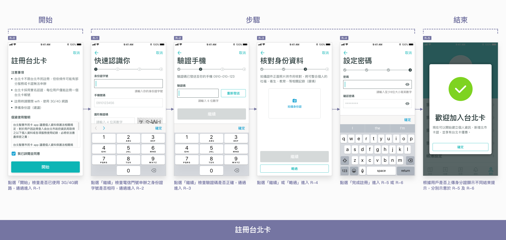
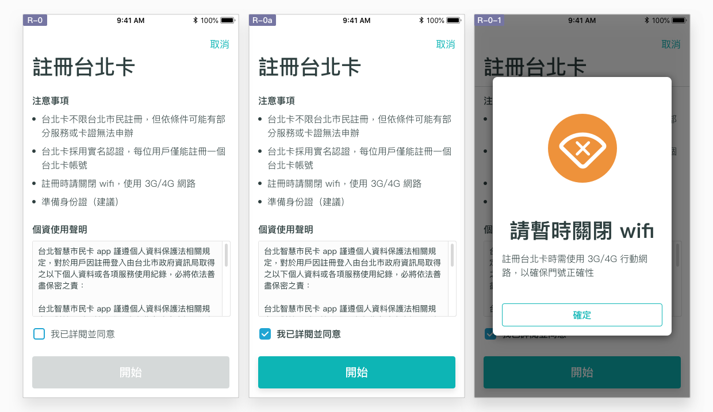
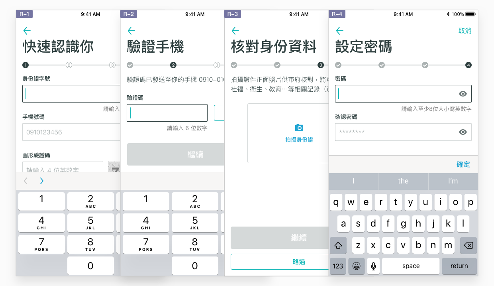
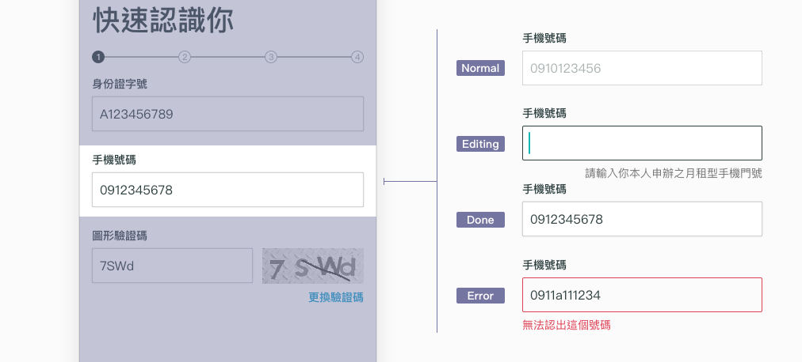
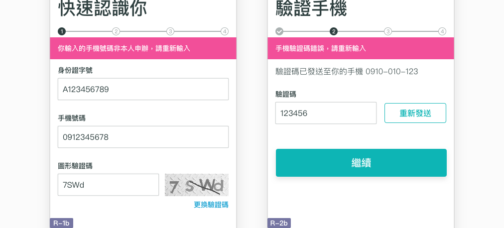
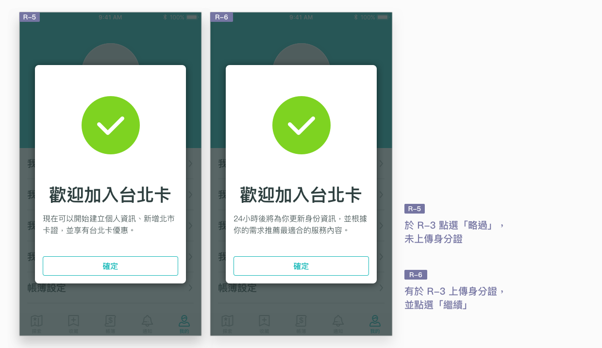
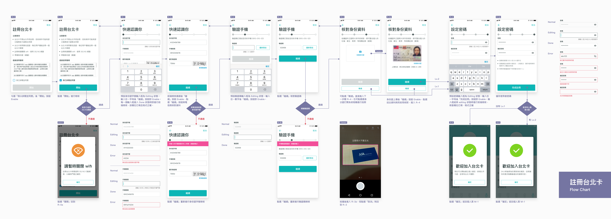

# 註冊台北卡

## 如何註冊台北卡帳戶？

### 建議我最佳方案

台北卡以「實名」為特色，因此其註冊流程也牽涉到實名程度、實名方法等不同的可能流程。不過，讓使用者在 App 的註冊流程中選擇實名方式，並不是一個聰明的作法。


在 12 場測試中，受測者每遇到「選擇認證等級」，都會花費三倍的時間，理解不同認證的服務內容及認證方法，遠遠拉低了完成註冊的效率。由於使用者操作手機的時間往往都較於零碎，這樣的設計明顯並不適合 App 使用。


相較於讓使用者選擇，由本 App 服務推薦最佳作法，降低使用者猶豫、浪費時間的可能性，會是比較好的作法。考慮到使用者可以於手機上操作完成、實名身份的信任感，以及註冊完後可以使用的服務數量，本 App 服務規劃以 **手機號碼** 註冊台北卡為主，結合「電信認證」、「OTP驗證」及「核對身份證（可略過）」。

### 跟隨線性流程

註冊台北卡要經過一連串的資料填寫及驗證，因此運用 [流程](./#liu-cheng) 類的特性，經由「開始－步驟－結束」三階段，讓線性結構更明確。將流程拆解開來可分為：

1. **開始：**告知註冊注意事項及同意條款
2. **步驟：**填寫個人資料、完成電信認證、OTP 驗證及身份證上傳
3. **結束：**包含成功或失敗等註冊結果，表示流程已結束

## 開始

作為 **流程** 的開始頁，其內容應達到承先啟後的效果。開始頁應明確顯示流程名稱「註冊台北卡」，以動詞撰寫，清楚揭示這個流程的最大目的。內容應包含：

1. **注意事項：**使用者必須注意哪些條件以順利完成註冊。
2. **同意條款：**必須取得使用者同意才能展開後續流程的法律條款。
3. **顯眼的主要按鈕「開始」**，為進入流程步驟的入口。


* 「開始」按鈕於勾選「我以詳閱並同意」後 Enable。
* 點選「開始」檢查是否已使用 3G/4G 網路，並以 [彈出視窗](../component/chu-chuang.md) 提供相對應的錯誤提示。


## 步驟

作為 **流程** 的步驟頁，每一步驟應有明確的步驟名稱，並以動詞撰寫。一個步驟應搭配一個主要按鈕，以及返回上一步、立即離開、略過此步驟等次要按鈕。註冊台北卡一共有四項步驟：

1. **快速認識你：**填寫帳號及電信驗證，確認身份。
2. **驗證手機：**填寫手機 OTP 驗證碼。
3. **核對身份資料：**上傳身分證正面照片（可以跳過，註冊結果不同）。
4. **設定密碼：**查看密碼規則並設定帳戶密碼。


* 每個步驟的預設狀態皆為第一個輸入框 Editing 及主要按鈕 Disable，直到使用者輸入任一符號，主要按鈕 Enable。點選主要按鈕將觸發後端檢核。
* 最後一個步驟的主要按鈕應明確指出「完成註冊」。


### 前端檢核

輸入框於不同狀態時應顯示不同的 [提示訊息](../component/untitled-2.md#ru-kuang)。

* **預設提示 \(Normal\)：**顯示輸入格式範例。
* **規則與輔助說明 \(Editing\)：**以「請輸入」開頭描述規則。
* **檢核錯誤提示 \(Error\)：**指出錯誤之處。

### 後端檢核

步驟中應盡量減少使用彈出視窗，而盡量以 [提示](../component/jing-gao-ti-shi.md) 的方式顯示於頁面中，以免過度打斷流程。註冊步驟中有兩個後端檢核點：

* **快速認識你 \(R-1\) 點選「繼續」後進行電信驗證：** 檢查使用者所輸入的身份證字號，與申辦門號時所填寫的身份證字號是否相同，若相同則通過檢核，進入下一步 \(R-2\)。若相異則顯示錯誤提示 \(R-1b\)。
* **驗證手機 \(R-2\) 點選「繼續」後進行 OTP 驗證：** 檢查使用者所輸入的 OTP 驗證碼，與已發送之驗證碼是否相同，若相同則通過檢核，進入下一步 \(R-3\)。若相一則顯示錯誤提示 \(R-2b\)。

## 結束

作為 **流程** 的結束頁，應揭示流程的結果（成功、中斷或失敗等等），並進行引導：

* **以** [**彈出視窗**](../component/chu-chuang.md) **告知註冊結果：** 如未上傳身份證，應告知註冊後開放的功能有哪些，讓使用者進一步探索。如有上傳身份證，則應告知 24 小時後將更新個人資訊，使其特別注意時間反饋的落差。
* **引導至後續操作：** 點選「確定」按鈕使用者回到個人頁 \(M-1\)，查看登入後的畫面資訊。

## Flow Chart



## Prototype

[前往連結](https://marvelapp.com/18ga893g)

