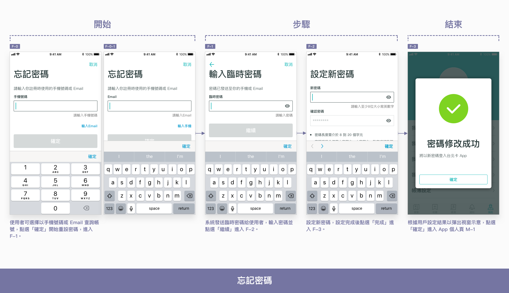
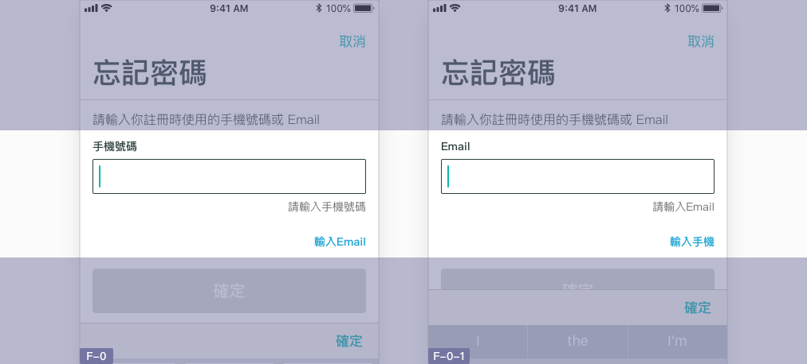
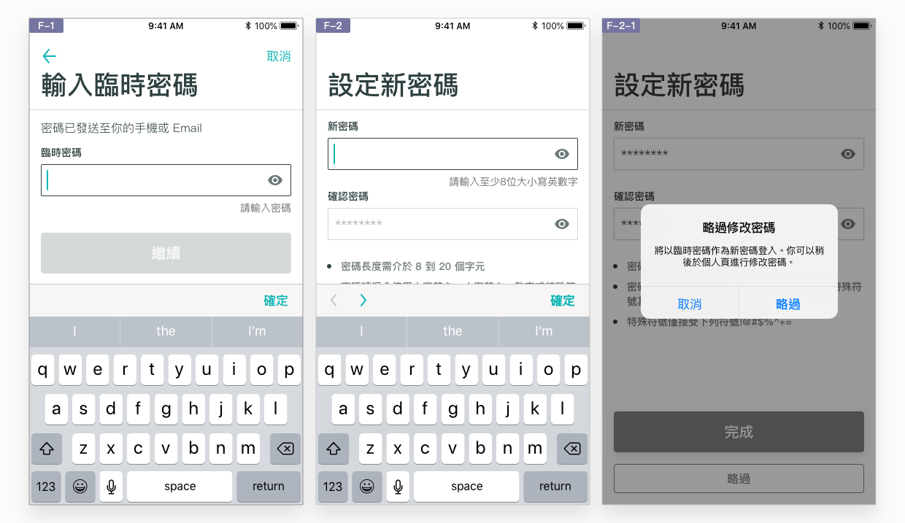
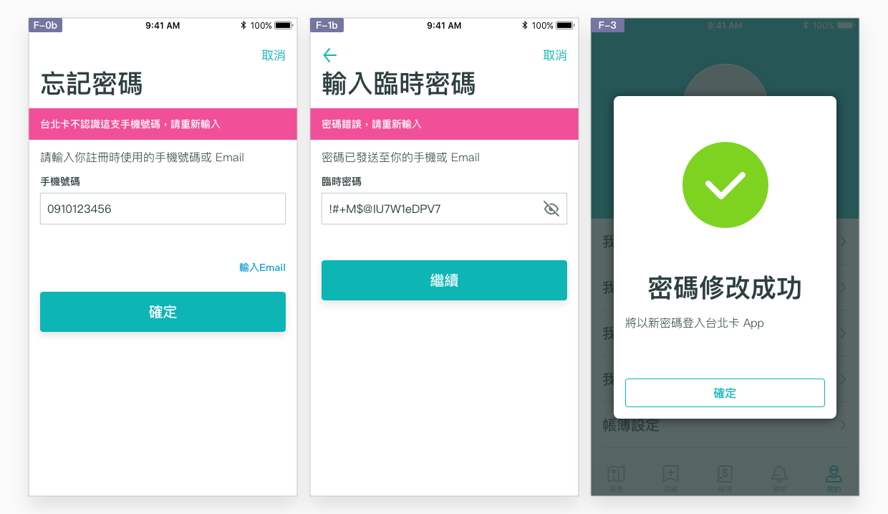
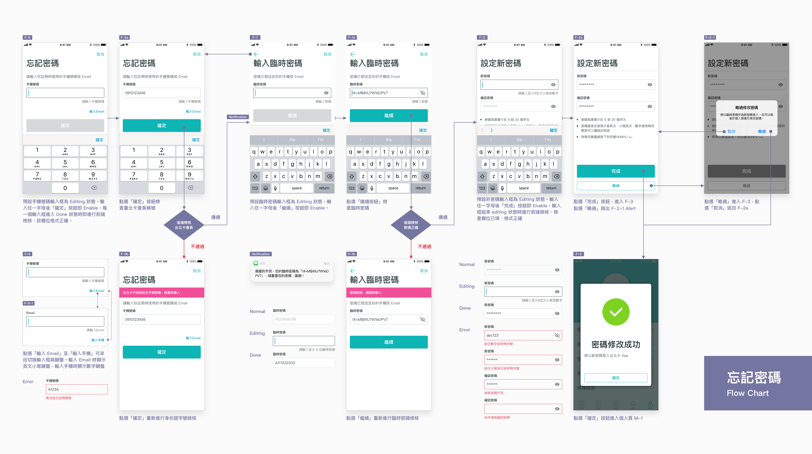

# 忘記密碼

## 忘記密碼時如何重新設定？

### 於「個人頁」登入時發生問題

已有台北卡帳戶的使用者，可能在想要登入時才發現忘記密碼了。使用者可於個人頁 \(M-1a\) 密碼輸入框下方發現「忘記密碼」的連結，點選進行「忘記密碼」的重設流程。

### 跟隨線性流程

忘記密碼要經過一連串的資料填寫及驗證，因此運用 [流程](./#liu-cheng) 類的特性，經由「開始－步驟－結束」三階段，讓線性結構更明確。將流程拆解開來可分為：

1. **開始：**填寫手機號碼或 Email 以搜尋帳號
2. **步驟：**輸入臨時密碼及設定新密碼（後者可略過）
3. **結束：**提示修改完成，表示流程已結束

## 開始

相對於 [註冊台北卡](tai-bei-ka.md)，忘記密碼的處理程序較單純，不需要太多的簡介及注意事項。開始頁除明確顯示流程名稱「忘記密碼」之外，應直接引導使用者開始以帳號取回密碼：

1. **帳號輸入框：**使用者必須輸入手機或 Email 帳號才能確認身份。因本 App 服務以手機號碼註冊，因此預設為手機號碼輸入框，並搭配數字鍵盤。
2. **切換手機號碼/Email：**為了於官網使用 Email 註冊的用戶，提供切換至 Email 輸入框的按鈕，點選後輸入框更換。
3. **顯眼的主要按鈕「確定」**，為進入忘記密碼步驟的入口。

## 步驟

作為 **流程** 的步驟頁，每一步驟應有明確的步驟名稱，並以動詞撰寫。一個步驟應搭配一個主要按鈕，以及返回上一步、立即離開、略過此步驟等次要按鈕。忘記密碼僅有兩項步驟：

1. **輸入臨時密碼：**填寫帳號及電信驗證，確認用戶身份。
2. **設定新密碼：**填寫新密碼。此步驟可略過，讓使用者可稍後再修改。以 [彈出視窗](../component/chu-chuang.md) 確認略過。

## 結束

由步驟中的前後端檢核排除可能的錯誤，讓忘記密碼的結束頁是「密碼修改成功」：

* **以** [**彈出視窗**](../component/chu-chuang.md) **宣告密碼修改成功：**提示將以新密碼登入。
* **引導至後續操作：**點選「確定」按鈕使用者回到個人頁 \(M-1\)，查看登入後的畫面資訊。

## Flow Chart



